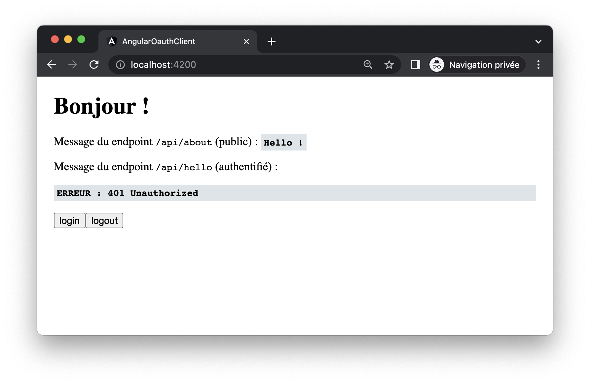
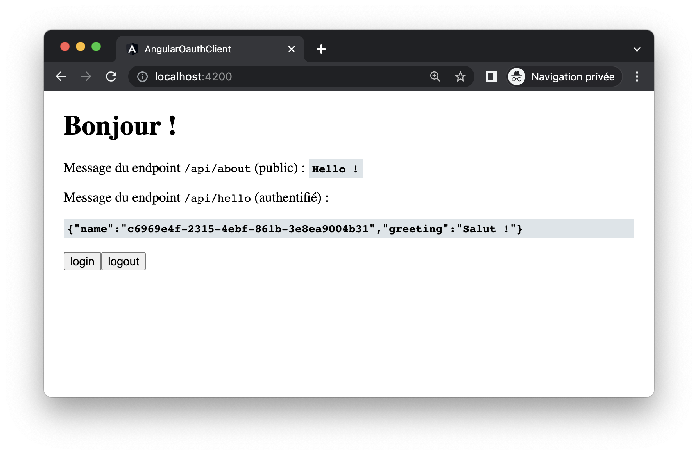

# Spring / Angular Keycloak demo

## Setup Keycloak

Lancez une instance Keycloak, par exemple avec Docker

    docker run -p 8080:8080 quay.io/keycloak/keycloak start-dev

Ou en téléchargeant le binaire depuis : https://www.keycloak.org/downloads

Le serveur keycloak écoute sur le port `8080`  
Si un autre port est utilisé, mettre à jour les configs [back](spring-resource-server/src/main/resources/application.yml) et [front](angular-oauth-client/src/keycloak/keycloak-init.ts).

1. Se connecter en tant qu'admin à Keycloak (credentials par défaut : `admin` / `admin`)
2. Créer un *realm* nommé `SpringBootKeycloak`
3. Configurer dans ce *realm* un *client* de type *OpenID Connect* et le nommer `login-app` (s'assurer qu'il est *public*)
4. Ajouter `http://localhost:4200/*` dans la section *valid redirect URIs*
5. Créer un utilisateur dans le *realm*, avec un nom d'utilisateur et un mot de passe

## Lancer l'aaplication Spring Boot

````sh
cd spring-resource-server
mvn spring-boot:run
````

### Test du endpoint public

    $ > curl http://localhost:8081/api/about
    Hello !

### Test du endpoint privé

    $ > curl -v http://localhost:8081/api/hello
    < HTTP/1.1 401 

### Test avec un token

Cet accès nécéssite un token JWT émis par Keycloak.

On peut l'obtenir par appel direct à Keycloak, avec les credentials de l'utilisateur créé lors du setup.

````sh
curl --location 'http://localhost:8080/realms/SpringBootKeycloak/protocol/openid-connect/token' \
    --header 'Content-Type: application/x-www-form-urlencoded' \
    --data-urlencode 'client_id=login-app' \
    --data-urlencode 'username=<LE USERNAME>' \
    --data-urlencode 'password=<LE MOT DE PASSE>' \
    --data-urlencode 'grant_type=password'
````

Qui donne une réponse de type :

````json
{
    "access_token": "eyJhbGciOiJ...", // etc...
    "expires_in": 300,
    "refresh_expires_in": 1800,
    // etc...
}
````

Nous pouvons utiliser ce token pour faire une requête vers le endpoint protégé :

````sh
$ > curl -v -H "Authorization: Bearer ey..." http://localhost:8081/api/hello
{"name":"(...)","greeting":"Salut !"}
````


## Lancer le front Angular

````sh
cd angular-oauth-client
npm install && npm start
````

Et accéder à <http://localhost:4200/>

Le front ne contient qu'un seul composant racine, qui appelle les endpoints et affiche simplement le résultat 

### Accès non identifé au front



### Front après connexion

Le bouton login redirige vers la page de login Keycloak.  
Saisir les identifiants de l'utilisateur créer lors du setup.

Après connection, vous serez redirigé vers le front, qui devrait ressembler alors à ceci :



Le front récupère le token, (le renouvelle si nécassaire) et l'envoie au back en header de la requête.
